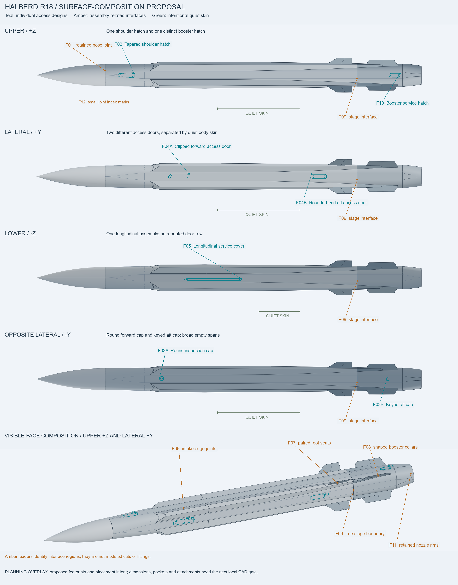
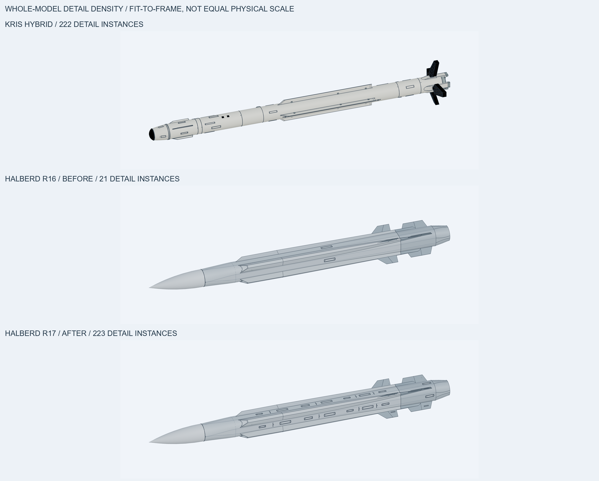
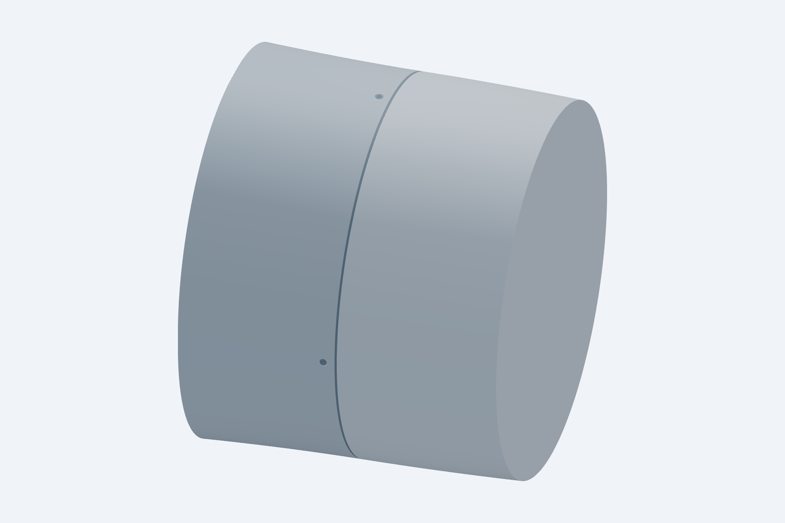
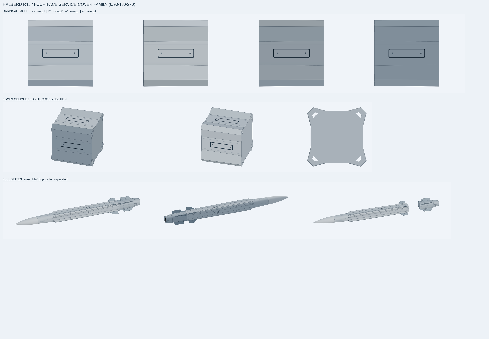
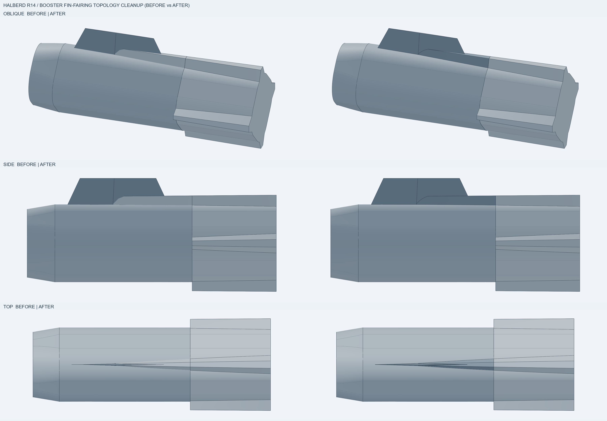
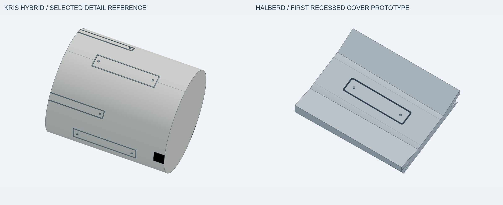
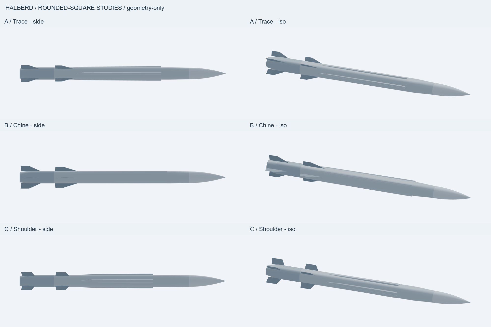

# Halberd rounded-square studies — review handoff

**Current design work (2026-09-27):** [R18 surface-layout proposal](R18_SURFACE_LAYOUT.md),
state **`concept-review`**. Seven individual access designs are distributed across
four faces with shared interface regions and intentional quiet skin. Primary
inspected the annotated four-face/whole-model map and enlarged shape studies.
The checked28-part presentation base preserves the approved exterior; proposed
new features exist as drawing overlays, not detailed CAD.



[Enlarged feature-design sheet](reviews/R18_Feature_Designs.png).

Previous candidate: **R17 `blocked`** — user rejected its repetitive
surface layout. [Independent critique and primary reassessment](R17_DESIGN_CRITIQUE.md)
identify a count-driven matrix, excessive border contrast and missing regional
design hierarchy. Geometry checks remain valid; the visual gate has failed.
Next: annotated four-face surface design with meaningful clusters and quiet spans
before another detailed propagation pass. All artifacts below are preserved evidence.

**Rejected R17 full-detail layout:** 223 surface-detail instances (Kris reference:
222), comprising 32 access-cover groups, the existing nose joint, 16 flat-face
seam accents, eight fin-root strips with hardware, and two nozzle rim groups.
There are 246 parts per full state. All 555 saved full/focus placements pass;
all new details have supporting contact and no unintended volume overlaps.
Primary inspected the all-side packet and Kris comparison. Full-layout user
acceptance was subsequently refused; no engine/runtime acceptance is implied.

[Whole R17](http://127.0.0.1:3247/?file=STEP/halberd_r17.step) · [Separated](http://127.0.0.1:3247/?file=STEP/halberd_r17_separated.step) · [Body detail](http://127.0.0.1:3247/?file=STEP/halberd_r17_focus.step) · [Nozzle detail](http://127.0.0.1:3247/?file=STEP/halberd_r17_nozzle_focus.step)



[Local detail review board](reviews/Halberd_R17_Detail_Review.png).

**Preserved R16 local prototype:** one shallow recessed ring and four slotted fasteners
at the existing nose/body interface. All38 non-main R15 parts remain identical;
all95 R16 placements pass native geometry checks, plus supporting contact,
clearances, recess/skin containment, stage transforms and materials. Primary
reviewed the actual Kris joint crop and R16 CAD-edge/shaded views. This brings
surface-detail objects to21; user accepted the local treatment ("Good").

[Joint close-up](http://127.0.0.1:3247/?file=STEP/halberd_r16_focus.step) · [Whole model](http://127.0.0.1:3247/?file=STEP/halberd_r16.step) · [Separated](http://127.0.0.1:3247/?file=STEP/halberd_r16_separated.step)



**Preserved R15 detailing pass:** four recessed covers, four borders and eight slotted
fasteners on the cardinal flats. R14 junction cleanup is preserved; all 26
unaffected parts remain identical. The checker passes all 95 saved placements,
seat/recess, interference, channel, stage and material checks. Primary inspected
the all-side layout; the next new family is a body-joint/interface prototype.

[Four-face detail crop](http://127.0.0.1:3247/?file=STEP/halberd_r15_focus.step) · [Whole model](http://127.0.0.1:3247/?file=STEP/halberd_r15.step) · [Separated](http://127.0.0.1:3247/?file=STEP/halberd_r15_separated.step)



**Preserved repair baseline:** R14 removes intersecting fin/fairing surfaces at all four
booster stations while preserving their combined outer shape. All 61 saved
placements pass; 23 unaffected R13 parts retain geometry and colors. The joined
fin/fairing uses the existing fin gray. Primary reviewed matched before/after
views: the ragged strip is replaced by a clean junction curve.

[Cleaned junction](http://127.0.0.1:3247/?file=STEP/halberd_r14_focus.step) · [Whole model](http://127.0.0.1:3247/?file=STEP/halberd_r14.step) · [Separated](http://127.0.0.1:3247/?file=STEP/halberd_r14_separated.step)



**Historical selection:** preserve C's nose (shared source geometry) and A's fins. The user clarified that the intakes, not fins, must rotate 45 degrees to align with the fins. The old intake treatment was rejected; [the one-corner intake prototype](INTAKE_REVIEW.md) records that earlier gate. R11/R12 below supersede its local review state; A/B/C remain preserved comparison history.

**Previous detailing candidate, carried into R14:** [R13 first detailing prototype](R12_DETAILING_CONTRACT.md), based on verified R12 fourfold propagation of the user-approved R11 exterior. One recessed dorsal cover adds a beveled rim, dark-gray perimeter and two slotted fasteners. All 67 saved full/focus placements pass; 26 unaffected R12 parts, stage transforms, channels and outer envelope are preserved. Primary visual review finds the perimeter heavier than Kris's fine border. User accepted the broad detail-object planning range, then prioritized the R14 junction repair before further detailing.

[Focused cover](http://127.0.0.1:3247/?file=STEP/halberd_r13_focus.step) · [Whole model](http://127.0.0.1:3247/?file=STEP/halberd_r13.step) · [Separated](http://127.0.0.1:3247/?file=STEP/halberd_r13_separated.step)



Evidence: `reviews/halberd_R13_checks.json`; five individual `R13_*.png` views plus comparison board. Kris/R12 reference views are the preserved prior packet. This is one local detailing gate, not whole-model completion.

## Compare

**Approved endpoint basis (2026-09-24):** [R11 ridge alignment](R11_RIDGE_ALIGNMENT_CONTRACT.md) supersedes R10. Its intake end follows the circled fin ridge, extending the roof endpoint 13.4375 mm aft while retaining intake and fin heights. The user approved R11 and its fourfold propagation, verified in R12.



| Study | Visual emphasis | Tradeoff | Assembled | Separated |
|---|---|---|---|---|
| A / Trace | Narrow, long intake rails on flat faces; swept compact diagonal fins | Closest to restrained second-reference silhouette; intakes remain subtle at full length | [Viewer](http://127.0.0.1:3246/?file=STEP/A_Trace.step) | [Viewer](http://127.0.0.1:3246/?file=STEP/A_Trace_Separated.step) |
| B / Chine | Corner-mounted intake rails; cardinal fins with longer swept roots | Strongest change in end-view architecture; larger axis-aligned fin envelope | [Viewer](http://127.0.0.1:3246/?file=STEP/B_Chine.step) | [Viewer](http://127.0.0.1:3246/?file=STEP/B_Chine_Separated.step) |
| C / Shoulder | Wider flat-face intake rails ending farther aft; cropped, more upright diagonal fins | Clearer intake mouth and fin silhouette, less understated than A | [Viewer](http://127.0.0.1:3246/?file=STEP/C_Shoulder.step) | [Viewer](http://127.0.0.1:3246/?file=STEP/C_Shoulder_Separated.step) |

The fixed brief deliberately keeps the same body/nose/stage proportions across all three; this comparison varies intake integration and fin architecture, not overall missile class. A is the recommended starting point for the user's second-image-dominant preference, subject to user selection.

## Review packet

- [Overview](reviews/ABC_Overview.png): side and forward oblique views.
- [Opposed](reviews/ABC_Opposed.png): top and opposite-side oblique views.
- [End views](reviews/ABC_Ends.png): fourfold arrangements and rounded-square/circular silhouette relationship.
- [Local details](reviews/ABC_Details.png): square-to-round transition and actual open intake mouths, with CAD edge lines. These are intentionally cropped local views; full noses are in the overview.
- [Separated stages](reviews/ABC_Separated.png): main stage retains its fins and shallow visual exhaust recess; booster translated aft 340 mm for inspection.

27 fresh source snapshots under `reviews/`, composed into the five `ABC_*.png` boards. Camera directions are fixed across candidates; orthographic scale is normalized from projected exported bounds per view. Local detail cameras use fixed positions/targets. The primary model directly inspected every final board, including all 27 constituent views.

Historical `A_first.png` is the initial diagnostic image before the analytic-tip repair; early `A_*.png` single-study boards and `snapshot_A.json` are first-milestone evidence, not the final comparison. Use the `ABC_*.png` boards for selection.

## Geometry evidence

| Check | Result |
|---|---|
| Total length | 3370 mm, all three |
| Main/booster section | 200 mm across flats, broad 70 mm corner radius inferred from supplied screenshot |
| Booster allocation | 561.666667 mm = total length / 6 |
| Stage seam | X=-1123.333333 mm, centered X-forward convention |
| Stage join | Outer perimeters agree at 679.822972 mm; main/booster axial boundaries agree |
| Native strict STEP validation | All six files PASS; 15 occurrences / 6 prototypes each; zero failures |
| Artifact checks | All three PASS; positive valid solids, bounds, rounded-section probes, fin/intake body intersections, fourfold volume symmetry, open mouth passage probes, rigid separated-state placements |
| Axis-aligned Y/Z spans | A: 276.337 mm; B: 370.000 mm; C: 293.308 mm. These are not radial diameters or verified aircraft clearance. |
| Viewer handoff | All six local file paths exist and their viewer URLs returned HTTP 200 |

Machine-readable results: `reviews/checks_ABC.json`, `reviews/native_validation.json`, and six `reviews/*_facts.json` files. Source parameters live in `src/study_shapes.py`.

The initial revolved analytical ogive failed the independent native STEP reader despite Python BREP validity. The delivered nose is a smooth 17-section loft approximating the same tangent-ogive curve, terminating at a visually pointed 0.35 mm radius. Both readers accept the replacement.

## Reproduce

Use `C:\Users\erena\.config\opencode\cadgen-venv\Scripts\python.exe` for Python and the sibling `cadgen.exe` for CLI commands. Verified runtime: cadgen 0.5.1 matching the installed CAD skill pin.

From the repository root, build these explicit entrypoints:

```text
cad/halberd_rounded_square/src/study_a.py
cad/halberd_rounded_square/src/study_a_separated.py
cad/halberd_rounded_square/src/study_b.py
cad/halberd_rounded_square/src/study_b_separated.py
cad/halberd_rounded_square/src/study_c.py
cad/halberd_rounded_square/src/study_c_separated.py
```

Then run with that interpreter:

```text
cad/halberd_rounded_square/src/check_studies.py
cad/halberd_rounded_square/src/validate_exports.py
cad/halberd_rounded_square/src/review_packet.py
```

Viewer workspace is `cad/halberd_rounded_square/`; launch `cadgen viewer --host 127.0.0.1 --json` there and use the returned port if different. The initial foreground launch was terminated by shell timeout; a hidden independent launcher recovered the server, verified with `cadgen viewer list` and HTTP requests.

## Remaining decision

Select A, B, C, or a named combination before detailed modeling. The 70 mm corner radius, intake dimensions and fin shapes are proposed interpretations, not measured reference dimensions. The original chat images were directly reviewed but have no verified durable local file copies. Actual aircraft fit, engine meshes, textures, packaging and runtime staging remain outside this geometry-only study boundary.
